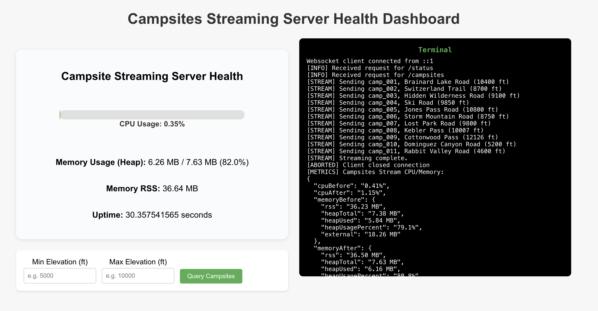
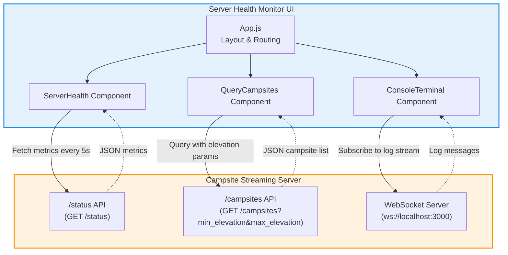

# Campsites Streaming Server Health Dashboard

A React-based dashboard for monitoring the health and activity of my [campsite streaming server](https://github.com/baileydunning/campsite-streaming-server) project. It visualizes real-time server metrics, lets you query campsites by elevation, and streams server logs live via WebSocket.



---

## Features

- **Server Health Visualization**
  - Live D3-powered chart showing CPU usage  
  - Heap memory and RSS (resident set size) display  
  - Uptime and error status

- **Campsite Query**
  - Enter minimum/maximum elevation to fetch and display a filtered list of campsites

- **Live Console Terminal**
  - Real-time streaming of server logs in a scrollable terminal component over WebSocket

---

## How It Works

### Server Health (`ServerHealth.js`)
- **Fetches** server metrics every 5 seconds from  
  `http://localhost:3000/status`
- **Renders:**
  - **CPU Usage**: horizontal bar chart (D3)  
  - **Heap Memory**: used vs. total with percentage  
  - **RSS Memory**: total process memory footprint  
  - **Uptime**: seconds since server start
- **Handles Errors:** shows a banner if metrics can’t be retrieved

### 2. Campsite Query (`QueryCampsites.js`)
- **Form Inputs:** `minElevation` and `maxElevation`
- **Fetches** data from  
  ```
  http://localhost:3000/campsites?min_elevation=5000&max_elevation=7000
  ```
- **Displays:** a list of matching campsites with name and elevation
- **Handles Errors:** displays validation or network errors

### 3. Console Terminal (`ConsoleTerminal.js`)
- **Connects** to `ws://localhost:3000` via WebSocket
- **Streams** incoming log messages live
- **Renders** logs in a fixed-height, scrollable window
- **Handles Errors:** notifies on connection failures or disconnects

---

## Architecture


---

## Getting Started

### Prerequisites
- **Node.js** v18 or newer
- **Streaming Server** running at:
  - HTTP API: `http://localhost:3000`
  - WebSocket: `ws://localhost:3000`

### Installation & Launch

Clone both the server and ui in separate terminal tabs, install dependencies and start

```bash
git clone https://github.com/baileydunning/campsite-streaming-server.git
cd server-health-monitor
npm install
npm start
```

```bash
git clone https://github.com/baileydunning/server-health-monitor.git
cd server-health-monitor
npm install
npm start
```

The React dev server runs on [http://localhost:3001](http://localhost:3001)

---

## Configuration

By default, the app points to `localhost:3000`. To change endpoints, update the URLs in:

- `components/ServerHealth.js`
- `components/QueryCampsites.js`
- `components/ConsoleTerminal.js`

---

## Troubleshooting

- **API Unreachable:**  
  Verify your backend server is up and CORS is configured correctly.

- **WebSocket Errors:**  
  Ensure `ws://localhost:3000` is accessible and not blocked by a firewall.

- **Port Conflicts:**  
  Change the React port by setting the `PORT` environment variable in `package.json` or your start script.
